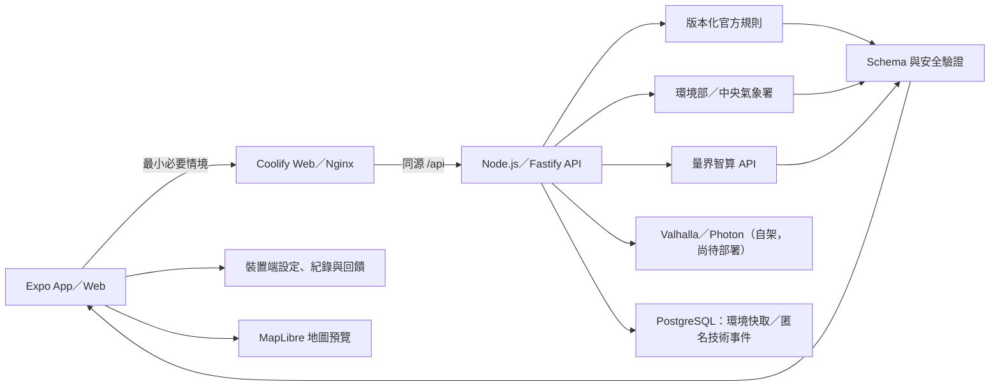

# AirMe 空氣健康小管家

> 競賽版跨平台產品｜決賽：2026-07-26
> 部署目標：自有 VPS 的 Coolify + PostgreSQL + 量界智算

> 競賽展示部署路徑：Coolify + PostgreSQL + 量界智算。正式展示前仍須完成真實外部服務、VPS 與決賽設備的端到端驗證。

AirMe 讓使用者用自然語言描述想做的活動，再把 AQI、天氣、最低限度個人敏感條件與官方安全底線，整理成可執行、可解釋且受安全邊界限制的個人行動卡。

## 命名對照

| 用途 | 名稱 |
|---|---|
| GitHub repository／本機根資料夾 | `AirMe` |
| Project slug／Coolify project | `airme` |
| 本機 Docker Compose project | `airme` |
| Coolify services | `airme-web`、`airme-api`、`airme-postgres` |

主要 `docker-compose.yml` 明確設定 `name: airme`；Compose services 使用 `web`、`api`、`postgres` 且不設定 `container_name`。

它不是醫療診斷工具，也不是通用聊天機器人。官方門檻由程式規則控制，AI 不能降低安全底線、發明門檻或判定症狀成因。

## 目前可操作的產品

- 同一套 Expo App 支援 iOS、Android 與 Web。
- 裝置端個人檔案與可選 AirMe 帳號：個人敏感條件、日誌與回饋預設留在裝置；帳號只保存 Email、顯示名稱、密碼 verifier、同意時間與登入工作階段，不會自動同步敏感資料。
- 自然語言活動輸入會先整理成活動、時間、地點、強度、時長與當下狀況，缺資料只問一個問題，使用者確認後才產生建議。
- 環境部 AQI 與中央氣象署資料 adapter，保留來源、時間、新鮮度與降級狀態。
- 量界智算 OpenAI 相容 `chat/completions` adapter，以 JSON object 產生固定格式行動卡。
- 程式規則先決定不可突破的風險底線，後端再次驗證模型輸出、資料引用與未經支持的保證，決定性規則會取代衝突建議。
- 限定在空品、活動安全與一般自我保護範圍內追問；醫療、緊急、離題與提示注入有固定處理。
- Air 日誌整合最多 20 筆活動、環境、建議摘要與最多 50 筆活動後回饋（是否進行、不舒服程度、建議是否有幫助、選填註記），只保存在裝置端。
- 路線頁可搜尋臺灣地點、以開源 Valhalla 規劃步行／單車／道路方案，並以 MapLibre 預覽路線與比較估算；未配置自架服務時保留清楚標示的 fixture 與外部地圖 fallback，不捏造即時導航或街道級空品。
- 全面採用淺綠、白色、柔和圓角與留白的亮色介面，AQI 黃／橙／紅只保留為風險語意。
- PostgreSQL 保存共享環境快取、不含 payload 的技術事件，以及最小化帳號／session 驗證資料；不保存個人設定、活動內容、回饋、精確路線或模型全文。
- 清楚標示的離線示範模式；外部服務不可用時不冒充即時 AI 結果。

完整範圍與驗收標準見 [產品規格](docs/product-spec.md) 與 [驗收清單](docs/acceptance.md)。

## 系統結構

```text
AirMe/
├── app/             # Expo Router：iOS／Android／Web 與 Nginx Docker image
├── backend/            # Node.js + Fastify：資料、規則、AI、安全與 PostgreSQL migration
├── packages/contracts/      # 前後端共用 Zod 資料契約
├── docker-compose.yml       # Coolify Compose：Web、API、PostgreSQL
└── docs/                    # 產品、架構、安全、競賽與部署文件
```

本專案採固定 component roots：Expo 直接位於 `app/`、Fastify 直接位於 `backend/`，共用契約位於 `packages/contracts/`。每個 workspace 的 `package.json` 直接位於 component 根目錄，不增加 project-name、framework-name 或其他分類包層。



後端是唯一可信任邊界。App／Web 不直接持有量界智算、環境部、中央氣象署或 PostgreSQL 的秘密。

## 本機開發

需要 Node.js 22 與 npm。從 repository 根目錄安裝一次依賴：

```bash
npm ci
```

啟動 API fixture 模式（不需要 PostgreSQL 或任何 key）：

```bash
AI_MODE=fixture DATABASE_REQUIRED=false npm run start --workspace airme-api
```

啟動 App／Web：

```bash
npm run start --workspace airme
```

前端預設 API 是 `http://localhost:3000/api`；若 API 使用其他 port，請在 `app/.env` 設定 `EXPO_PUBLIC_API_BASE_URL`。預設 Demo 模式不需要 API key，也不會把 fixture 說成即時資料。

## 品質與評估

```bash
npm test
npm run lint
npm run typecheck
npm run build
npm run evaluate
```

`npm run evaluate` 會執行 30 個正常、敏感、資料品質、醫療、緊急、離題與提示注入案例。

本次架構遷移實際驗證：

- 共用契約、API 與 App 共 206 項自動化測試通過（12 + 138 + 56），涵蓋帳號 session、路線／地點 adapter 與 Web session 回歸。
- 固定安全評估 30/30 通過。
- `npm run lint`、三個 workspace typecheck、production Web build、安全評估 30/30 與 Playwright fixture E2E 已於本輪通過。
- Node 22.22.3 下的 Playwright fixture E2E 已通過：首次設定、活動理解、行動卡、醫療與緊急邊界、回饋與 Air 日誌皆可在無後端時完成。
- 既有本機 AirMe Compose 三服務與五個核心 AI／環境 endpoint 曾完成驗證；本輪新增的帳號 migration、Valhalla／Photon 與 MapLibre production provider 尚未在 Compose／VPS 實際部署。
- 尚未對 VPS／Coolify production、真實量界／政府 key、Valhalla／Photon、production tiles 或實體 iOS／Android 執行驗收。

## 環境變數

安全範例位於 [app/.env.example](app/.env.example) 與 [backend/.env.example](backend/.env.example)。

前端只有非秘密設定：

- `EXPO_PUBLIC_API_BASE_URL`
- `EXPO_PUBLIC_API_TIMEOUT_MS`
- `EXPO_PUBLIC_MAP_STYLE_URL`

API 的核心設定：

- `AI_MODE`：`fixture` 或 `live`
- `LIANGJIE_AI_BASE_URL`、`LIANGJIE_AI_MODEL`、`LIANGJIE_AI_API_KEY`
- `MOENV_API_KEY`、`CWA_API_KEY`
- `DATABASE_URL`，或 `DATABASE_HOST`、`DATABASE_PORT`、`DATABASE_NAME`、`DATABASE_USER`、`DATABASE_PASSWORD`
- `DATABASE_REQUIRED`
- `ALLOWED_ORIGINS`、`REQUEST_TIMEOUT_MS`
- `AI_MAX_REQUESTS_PER_MINUTE`、`AI_MAX_CONCURRENCY`
- `CONTEXT_SIGNING_SECRET`、`CONTEXT_TTL_SECONDS`
- `AUTH_SESSION_HMAC_SECRET`、`AUTH_SESSION_TTL_SECONDS`
- `VALHALLA_ROUTE_URL`、`PHOTON_SEARCH_URL`、`ROUTING_MAX_REQUESTS_PER_MINUTE`、`ROUTING_MAX_CONCURRENCY`

所有 `EXPO_PUBLIC_*` 都會進入 bundle，不能放 secret。正式值只放 Coolify Environment Variables 或本機忽略的 `.env`。

## API

| Method | Route | 用途 |
|---|---|---|
| `GET` | `/api/health` | 不洩漏設定值的服務／資料庫 readiness |
| `POST` | `/api/environment` | 以 request body 傳送粗略地點，回傳標準化 AQI／天氣與來源狀態 |
| `POST` | `/api/activity-intents` | 不持久化的活動結構化理解與單一澄清問題 |
| `POST` | `/api/recommendations` | 規則約束的結構化行動卡 |
| `POST` | `/api/follow-ups` | 原情境內的限定追問與固定拒答 |
| `POST` | `/api/auth/register`、`/api/auth/login` | 建立帳號或登入，回傳 opaque session token |
| `GET` | `/api/auth/session` | 驗證目前 Bearer session |
| `POST` / `DELETE` | `/api/auth/logout`、`/api/auth/account` | 登出目前裝置／刪除帳號及全部 sessions |
| `POST` | `/api/geocoding/search` | 僅當次的臺灣地點搜尋 |
| `POST` | `/api/routes` | 僅當次的 Valhalla 路線比較 |

Request／response 型別由 `packages/contracts` 共用；HTTP 錯誤使用穩定代碼，不回傳 stack trace、provider 原始錯誤或秘密。

## Coolify 部署

此 repository 根目錄的 [docker-compose.yml](docker-compose.yml) 定義 `web`、`api`、`postgres` 三個服務。Coolify 將公開網域指向 `web:80`；Nginx 會把同源 `/api/*` 反向代理到 API 容器，因此 Web 不必設定公開 API 網域或 CORS。

Coolify + 量界智算是競賽展示的部署路徑。部署前需在 Coolify 填入必要的 PostgreSQL 密碼、context／session signing secret、量界與政府 API key，並提供自架 Valhalla、Photon 與 MapLibre 圖磚樣式端點。GitHub Actions 已設定 Node 22 的品質與 fixture E2E 檢查；目前仍無 production URL、release、路由圖資或實際 VPS 部署驗證。

本機 Docker fixture 測試使用同一個 Compose 專案的三個服務，不會碰觸其他專案：

```bash
cp .env.local.example .env.local
docker compose --env-file .env.local -f docker-compose.yml -f docker-compose.local.yml up --build -d
```

若要在本機驗證真實量界 AI，請將 `AI_MODE=live`、`LIANGJIE_AI_BASE_URL`、`LIANGJIE_AI_MODEL` 與 `LIANGJIE_AI_API_KEY` 放在另一個本機忽略的 env 檔，並在啟動指令中將它列為第二個 `--env-file`。預設 fixture 指令不會呼叫真實 AI。

```bash
docker compose --env-file .env.local --env-file .env.ai.local -f docker-compose.yml -f docker-compose.local.yml up --build -d
```

完成後開啟 `http://localhost:8080`；停止時只停止 AirMe：

```bash
docker compose --env-file .env.local -f docker-compose.yml -f docker-compose.local.yml down
```

## 隱私與安全

- 帳號只蒐集 Email、顯示名稱、經 scrypt 處理的密碼 verifier、同意時間與 session digest；不保存密碼明文。未登入也可使用裝置端個人檔案。
- 不蒐集姓名、學號、學校、聯絡方式、病歷或長期 GPS 軌跡；可選裝置暱稱只留在本機且不傳後端。
- 新增地點持久化前四捨五入到小數二位（約公里級），API 為舊資料相容最多接受三位，且只接受臺灣服務範圍；後端只接收當次推論必要內容。
- 個人設定、回饋、行動紀錄、路線輸入與完整活動文字不寫入 PostgreSQL。
- 路線與地點搜尋的精確座標只存在請求記憶體；不寫入 PostgreSQL cache、service event 或 App 日誌。
- PostgreSQL 只保存環境快取與 request ID、路徑、狀態碼、耗時等匿名技術事件。
- 嚴重呼吸困難、昏厥等緊急描述會停止一般建議並提示立即尋求身邊成人與當地緊急協助。

詳見 [安全與隱私](docs/security-and-privacy.md) 與 [AI 安全與評估](docs/ai-safety-and-evaluation.md)。

## 文件索引

- [學生前端協作與開發教學（Git、GitHub、VS Code、Expo）](docs/student-frontend-guide.md)
- [需求基準](docs/requirements.md)
- [產品規格](docs/product-spec.md)
- [驗收清單](docs/acceptance.md)
- [系統架構](docs/architecture.md)
- [外部整合](docs/integrations.md)
- [資料與儲存](docs/data-and-storage.md)
- [安全與隱私](docs/security-and-privacy.md)
- [部署計畫](docs/deployment.md)
- [競賽展示](docs/competition.md)

## 版本控制與授權

- Repository 已有版本控制與遠端連線；commit、push、PR、release 與部署仍都需要使用者個別明確授權。
- 每次對版本控制或遠端操作前，必須依 [AGENTS.md](AGENTS.md) 掃描秘密、個資與不應提交文件。
- 原始碼採 MIT License（著作權標示為 `AirMe contributors`）；政府資料、第三方套件、字型與外部素材仍依各自授權與 attribution，不被本 LICENSE 取代。
