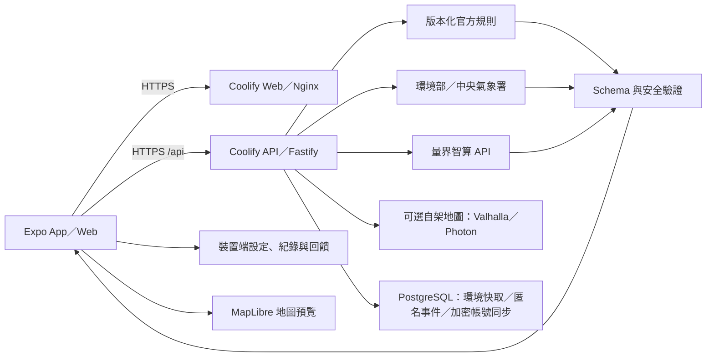

# AirMe 空氣健康小管家

> 競賽版跨平台產品｜決賽：2026-07-26
> 部署目標：自有 VPS 的 Coolify + PostgreSQL + 量界智算

> 競賽展示部署路徑：Coolify + PostgreSQL + 量界智算。正式展示前仍須完成真實外部服務、VPS 與決賽設備的端到端驗證。

AirMe 讓使用者用自然語言描述想做的活動，再把 AQI、天氣、最低限度個人敏感條件與官方安全底線，整理成可執行、可解釋且受安全邊界限制的個人行動卡。

## 命名對照

| 用途 | 名稱 |
|---|---|
| GitHub repository／本機根資料夾 | `AirMe` |
| Project slug／Coolify project | `airme` |
| 本機 Docker Compose project | `airme` |
| Coolify Resources | `airme-web`、`airme-api`、`airme-postgres` |

正式部署使用三個獨立 Coolify Resource；`docker-compose.yml` 僅供本機驗證，明確設定 `name: airme`，其 services 使用 `web`、`api`、`postgres` 且不設定 `container_name`。

它不是醫療診斷工具，也不是通用聊天機器人。官方門檻由程式規則控制，AI 不能降低安全底線、發明門檻或判定症狀成因。

## 目前可操作的產品

- 同一套 Expo App 支援 iOS、Android 與 Web。
- AirMe 帳號是產品入口：完成 Email 註冊／登入後才建立個人檔案。設定、粗略地點、結構化日誌與回饋可在設定 `CLOUD_SYNC_ENCRYPTION_KEY` 的後端以 AES-256-GCM 加密同步；不保存完整活動文字、追問 token、模型原文或導航軌跡。
- 自然語言活動輸入會先整理成活動、時間、地點、強度、時長與當下狀況；使用者可在 800 字契約內補充更多資訊，缺資料時一次只問一個問題，確認後才產生建議。
- 環境部 AQI 與中央氣象署資料 adapter 優先使用；未設定 key 或官方來源失敗時，才明確標示為 Open-Meteo 模型資料的降級來源，保留來源、時間與新鮮度。
- 量界智算 OpenAI 相容 `chat/completions` adapter，以 JSON object 產生固定格式行動卡。
- 程式規則先決定不可突破的風險底線，後端再次驗證模型輸出、資料引用與未經支持的保證，決定性規則會取代衝突建議。
- 限定在空品、活動安全與一般自我保護範圍內追問；醫療、緊急、離題與提示注入有固定處理。
- Air 日誌整合最多 20 筆活動、環境、建議摘要與最多 50 筆活動後回饋（是否進行、不舒服程度、建議是否有幫助、選填註記）；可按日期／風險篩選、開啟詳情及補填或更新同一筆回饋。本機保存後會在已設定的加密雲端同步中更新。
- 路線頁可搜尋臺灣地點、以開源 Valhalla 規劃步行／單車／道路方案，並以 MapLibre 預覽路線、比較估算、起終點摘要與文字步驟。`docker-compose.maps.yml` 提供自架 Valhalla、Photon、Planetiler 與 TileServer GL 的可選部署路徑；台灣圖資與 Photon 索引必須經明確 bootstrap 建立，尚未在 VPS 驗證前仍安全降級，且不捏造即時導航或街道級空品。
- 全面採用淺綠、白色、柔和圓角與留白的亮色介面，AQI 黃／橙／紅只保留為風險語意。
- PostgreSQL 保存共享環境快取、不含 payload 的技術事件、最小化帳號／session 驗證資料與可選的 AES-256-GCM 加密帳號同步 snapshot；不保存完整活動內容、精確路線、context token 或模型全文。
- 清楚標示的離線示範模式；外部服務不可用時不冒充即時 AI 結果。

完整範圍與驗收標準見 [產品規格](docs/product-spec.md) 與 [驗收清單](docs/acceptance.md)。

## 系統結構

```text
AirMe/
├── app/             # Expo Router：iOS／Android／Web 與 Nginx Docker image
├── backend/            # Node.js + Fastify：資料、規則、AI、安全與 PostgreSQL migration
├── packages/contracts/      # 前後端共用 Zod 資料契約
├── docker-compose.yml       # 本機 Compose：Web、API、PostgreSQL
├── docker-compose.maps.yml  # 可選的自架開源地圖 overlay
├── docker/maps/             # Photon bootstrap runtime
└── docs/                    # 產品、架構、安全、競賽與部署文件
```

本專案採固定 component roots：Expo 直接位於 `app/`、Fastify 直接位於 `backend/`，共用契約位於 `packages/contracts/`。每個 workspace 的 `package.json` 直接位於 component 根目錄，不增加 project-name、framework-name 或其他分類包層。



後端是唯一可信任邊界。App／Web 不直接持有量界智算、環境部、中央氣象署或 PostgreSQL 的秘密。

## 本機開發

需要 Node.js 22 與 npm。從 repository 根目錄安裝一次依賴：

```bash
npm ci
```

啟動 API fixture 模式（不需要 PostgreSQL 或任何 key）：

```bash
AI_MODE=fixture DATABASE_REQUIRED=false npm run start --workspace airme-api
```

啟動 App／Web：

```bash
npm run start --workspace airme
```

前端預設 API 是 `http://localhost:3000/api`；若 API 使用其他 port，請在 `app/.env` 設定 `EXPO_PUBLIC_API_BASE_URL`。預設 Demo 模式不需要 API key，也不會把 fixture 說成即時資料。

## 品質與評估

```bash
npm test
npm run lint
npm run typecheck
npm run build
npm run evaluate
```

`npm run evaluate` 會執行 30 個正常、敏感、資料品質、醫療、緊急、離題與提示注入案例。

本次架構遷移實際驗證：

- 共用契約、API 與 App 共 232 項自動化測試通過（12 + 147 + 73），涵蓋帳號 session、強制登入入口、加密雲端同步與跨帳號隔離、公開環境資料 fallback、路線／地點 adapter、OpenStreetMap 交接與 Web session 回歸。
- 固定安全評估 30/30 通過。
- `npm run lint`、三個 workspace typecheck、production Web build、安全評估 30/30 與 Playwright fixture E2E 已於本輪通過。
- Node 22.22.3 下的 Playwright fixture E2E 已通過：首次設定、活動理解、行動卡、醫療與緊急邊界、回饋與 Air 日誌皆可在無後端時完成。
- Node 22 隔離 Compose 已完成 image build、PostgreSQL migration、API health、虛構帳號的加密同步寫入／讀回、密文檢查與刪帳 cascade 驗證；本輪另驗證可選地圖 overlay 的 Compose 組態、Photon／TileServer GL image build，以及以空 MBTiles 提供 AirMe style endpoint 與 OSM attribution。尚未下載台灣正式圖資、驗證 Valhalla／Photon／TileServer GL 實際資料流程或 VPS。
- 已驗證 Coolify production 的 `airme-api`／`airme-postgres` migration、container healthcheck 與公開 API health；真實量界／政府 key、已建立台灣圖資的 Valhalla／Photon／TileServer GL、Web→API CORS 與實體 iOS／Android 仍待驗收。

## 環境變數

安全範例位於 [app/.env.example](app/.env.example) 與 [backend/.env.example](backend/.env.example)。

前端只有非秘密設定：

- `EXPO_PUBLIC_API_BASE_URL`
- `EXPO_PUBLIC_API_TIMEOUT_MS`
- `EXPO_PUBLIC_MAP_STYLE_URL`

API 的核心設定：

- `AI_MODE`：`fixture` 或 `live`
- `LIANGJIE_AI_BASE_URL`、`LIANGJIE_AI_MODEL`、`LIANGJIE_AI_API_KEY`
- `MOENV_API_KEY`、`CWA_API_KEY`
- `OPEN_METEO_FALLBACK_ENABLED`：競賽／非商業驗證的明確模型資料降級開關；公開商業環境須先確認授權與 attribution
- `DATABASE_URL`，或 `DATABASE_HOST`、`DATABASE_PORT`、`DATABASE_NAME`、`DATABASE_USER`、`DATABASE_PASSWORD`
- `DATABASE_REQUIRED`
- `ALLOWED_ORIGINS`、`REQUEST_TIMEOUT_MS`
- `AI_MAX_REQUESTS_PER_MINUTE`、`AI_MAX_CONCURRENCY`
- `CONTEXT_SIGNING_SECRET`、`CONTEXT_TTL_SECONDS`
- `AUTH_SESSION_HMAC_SECRET`、`AUTH_SESSION_TTL_SECONDS`
- `CLOUD_SYNC_ENCRYPTION_KEY`：32-byte base64url 的雲端同步 AES-256-GCM key；未設定不啟用同步
- `VALHALLA_ROUTE_URL`、`PHOTON_SEARCH_URL`、`ROUTING_MAX_REQUESTS_PER_MINUTE`、`ROUTING_MAX_CONCURRENCY`
- `MAP_PUBLIC_BASE_URL`、`MAP_ALLOWED_HOSTS`、`EXPO_PUBLIC_MAP_STYLE_URL`：可選自架圖磚的公開 URL／Host allowlist／前端 style URL；均非秘密

所有 `EXPO_PUBLIC_*` 都會進入 bundle，不能放 secret。正式值只放 Coolify Environment Variables 或本機忽略的 `.env`。

## API

| Method | Route | 用途 |
|---|---|---|
| `GET` | `/` | API 狀態入口，回傳健康檢查路徑 |
| `GET` | `/api/health` | 不洩漏設定值的服務／資料庫 readiness |
| `POST` | `/api/environment` | 以 request body 傳送粗略地點，回傳標準化 AQI／天氣與來源狀態 |
| `POST` | `/api/activity-intents` | 不持久化的活動結構化理解與單一澄清問題 |
| `POST` | `/api/recommendations` | 規則約束的結構化行動卡 |
| `POST` | `/api/follow-ups` | 原情境內的限定追問與固定拒答 |
| `POST` | `/api/auth/register`、`/api/auth/login` | 建立帳號或登入，回傳 opaque session token |
| `GET` | `/api/auth/session` | 驗證目前 Bearer session |
| `POST` / `DELETE` | `/api/auth/logout`、`/api/auth/account` | 登出目前裝置／刪除帳號及全部 sessions |
| `GET` / `PUT` | `/api/account/state` | 讀取／寫入已驗證帳號的加密同步 snapshot |
| `POST` | `/api/geocoding/search` | 僅當次的臺灣地點搜尋 |
| `POST` | `/api/routes` | 僅當次的 Valhalla 路線比較 |

Request／response 型別由 `packages/contracts` 共用；HTTP 錯誤使用穩定代碼，不回傳 stack trace、provider 原始錯誤或秘密。

## Coolify 部署

Coolify 以三個獨立 Resource 部署：`airme-web`（`app/Dockerfile`）、`airme-api`（`backend/Dockerfile`）與 `airme-postgres`（Coolify PostgreSQL 17）。兩個 Application 的 Base Directory 都是 `/`，Dockerfile Location 分別為 `/app/Dockerfile`、`/backend/Dockerfile`。Web 在 build 時以 `EXPO_PUBLIC_API_BASE_URL=https://api.<your-domain>/api` 注入 API URL，API 的 `ALLOWED_ORIGINS` 必須包含 Web 的完整 HTTPS origin。因 API 啟動前會跑 migration，Coolify 的 `/api/health` Start Period 固定為 90 秒。根目錄 [docker-compose.yml](docker-compose.yml) 僅供本機三容器驗證。

Coolify + 量界智算是競賽展示的部署路徑。`airme-api` 與 `airme-postgres` 已在 Coolify 的 production environment 部署，且 API health 已由公開 HTTPS URL 驗證；Web、真實 AI／政府資料、跨網域 CORS、備份與完整決賽設備流程仍待端到端驗證。API Resource 的 runtime variables 使用 Coolify PostgreSQL 的 internal `DATABASE_URL`、context／session signing secret、量界與政府 API key；前端只填公開 build variables。可選地圖不屬於這三個 P0 Resource，必須另建受資源限制的服務與完整 HTTPS style URL 後才可啟用。GitHub Actions 已設定 Node 22 的品質與 fixture E2E 檢查。

本機 Docker fixture 測試使用同一個 Compose 專案的三個服務，不會碰觸其他專案：

```bash
cp .env.local.example .env.local
docker compose --env-file .env.local -f docker-compose.yml -f docker-compose.local.yml up --build -d
```

若要在本機驗證真實量界 AI，請將 `AI_MODE=live`、`LIANGJIE_AI_BASE_URL`、`LIANGJIE_AI_MODEL` 與 `LIANGJIE_AI_API_KEY` 放在另一個本機忽略的 env 檔，並在啟動指令中將它列為第二個 `--env-file`。預設 fixture 指令不會呼叫真實 AI。

```bash
docker compose --env-file .env.local --env-file .env.ai.local -f docker-compose.yml -f docker-compose.local.yml up --build -d
```

完成後開啟 `http://localhost:8080`；停止時只停止 AirMe：

```bash
docker compose --env-file .env.local -f docker-compose.yml -f docker-compose.local.yml down
```

## 隱私與安全

- 帳號只蒐集 Email、顯示名稱、經 scrypt 處理的密碼 verifier、同意時間與 session digest；不保存密碼明文。啟用同步時，結構化設定、粗略地點、日誌摘要與回饋會先加密再存入帳號專屬資料列。
- 不蒐集姓名、學號、學校、聯絡方式、病歷或長期 GPS 軌跡；完整活動文字、追問內容、context token、模型全文與路線座標不會進入同步 snapshot。
- 新增地點持久化前四捨五入到小數二位（約公里級），API 為舊資料相容最多接受三位，且只接受臺灣服務範圍；後端只接收當次推論必要內容。
- 完整活動文字、路線輸入與模型全文不寫入 PostgreSQL；雲端同步只保存經 schema 限制的設定、粗略地點、日誌摘要與回饋，且資料庫中為加密 ciphertext。
- 路線與地點搜尋的精確座標只存在請求記憶體；不寫入 PostgreSQL cache、service event 或 App 日誌。
- PostgreSQL 只保存環境快取與 request ID、路徑、狀態碼、耗時等匿名技術事件。
- 嚴重呼吸困難、昏厥等緊急描述會停止一般建議並提示立即尋求身邊成人與當地緊急協助。

詳見 [安全與隱私](docs/security-and-privacy.md) 與 [AI 安全與評估](docs/ai-safety-and-evaluation.md)。

## 文件索引

- [學生前端協作與開發教學（Git、GitHub、VS Code、Expo）](docs/student-frontend-guide.md)
- [需求基準](docs/requirements.md)
- [產品規格](docs/product-spec.md)
- [驗收清單](docs/acceptance.md)
- [系統架構](docs/architecture.md)
- [外部整合](docs/integrations.md)
- [資料與儲存](docs/data-and-storage.md)
- [安全與隱私](docs/security-and-privacy.md)
- [部署計畫](docs/deployment.md)
- [競賽展示](docs/competition.md)

## 版本控制與授權

- Repository 已有版本控制與遠端連線；commit、push、PR、release 與部署仍都需要使用者個別明確授權。
- 每次對版本控制或遠端操作前，必須依 [AGENTS.md](AGENTS.md) 掃描秘密、個資與不應提交文件。
- 原始碼採 MIT License（著作權標示為 `AirMe contributors`）；政府資料、第三方套件、字型與外部素材仍依各自授權與 attribution，不被本 LICENSE 取代。
