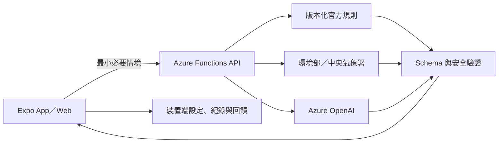

# AirMe 空氣健康小管家

> 競賽版跨平台產品｜決賽：2026-07-26
> 本機產品已實作並完成 Demo 驗證；Azure 部署仍為 `planned`

AirMe 讓使用者用自然語言描述想做的活動，再把 AQI、天氣、最低限度個人敏感條件與官方安全底線，整理成可執行、可解釋且能安全追問的個人行動卡。

它不是醫療診斷工具，也不是通用聊天機器人。官方門檻由程式規則控制，生成式 AI 不得降低安全底線、發明門檻或判定症狀成因。

## 目前可操作的產品

- 同一套 Expo App 支援 iOS、Android 與 Web；不是學生端／教師端兩套產品。
- 初次設定敏感條件、常用地點、通勤方式與常見活動。
- 自然語言活動輸入：活動、時間、地點、強度與當下狀況。
- 環境部 AQI 與中央氣象署資料 adapter，保留來源、時間、新鮮度與降級狀態。
- Azure OpenAI Responses API adapter，以嚴格 JSON Schema 產生固定格式行動卡。
- 程式規則先決定不可突破的風險底線，後端再次驗證模型輸出。
- 限定在空品、活動安全與一般自我保護範圍內追問；醫療、緊急、離題與提示注入有固定處理。
- 五秒活動回饋與最多 20 筆個人紀錄，只保存在裝置端。
- 清楚標示的離線示範模式；外部服務不可用時不冒充即時 Azure 結果。
- 30 個可重播 AI／安全評估案例。

完整範圍與驗收標準見 [產品規格](docs/product-spec.md) 與 [驗收清單](docs/acceptance.md)。

## 系統結構

```text
AirMe/
├── apps/client/             # Expo Router：iOS／Android／Web
├── services/api/            # Azure Functions v4：資料、規則、AI、安全邊界
├── packages/contracts/      # 前後端共用 Zod 資料契約
├── docs/                    # 產品、架構、安全、競賽與部署文件
├── package.json             # npm workspaces 與全專案品質指令
└── package-lock.json        # 單一鎖檔
```



後端是唯一可信任邊界。App／Web 不直接持有 Azure OpenAI、環境部或中央氣象署金鑰，也不建立雲端個人資料庫。

## 快速開始

需要 Node.js 22 與 npm。從 repository 根目錄安裝一次依賴：

```bash
npm ci
```

啟動 App／Web：

```bash
npm run start --workspace airme
```

預設為 `DEMO` 模式，不需要 API key，也不會把 fixture 說成即時資料。按 Expo 終端指示開啟 Web、iOS Simulator 或 Android Emulator。

啟動本機 Functions API：

```bash
npm run start --workspace airme-api
```

需要 Azure Functions Core Tools 4.x；若使用 `UseDevelopmentStorage=true`，另需 Azurite。尚未以真實金鑰完成政府 API 與 Azure OpenAI 的本機端到端呼叫。

## 品質與評估

```bash
npm test
npm run lint
npm run typecheck
npm run build
npm run evaluate
```

`npm run evaluate` 會執行固定的 30 個正常、敏感、資料品質、醫療、緊急、離題與提示注入案例。

截至 2026-07-13 已實際完成：

- 共用契約、API 與前端自動化測試。
- TypeScript typecheck、Expo lint、Functions build 與 Web static export。
- 評估資料集 30/30 通過。
- Azure Functions Core Tools 本機 fixture smoke：四條 endpoint 均為 HTTP 200，回應通過共用 schema；未啟動 Azurite 時 storage health 會警告。
- 375×812 手機與 1440px 桌面瀏覽器 Demo：設定、活動輸入、行動卡、醫療拒答、回饋、紀錄與設定頁。
- 瀏覽器操作期間 0 console error、0 console warning。

尚未驗證：實體 iOS／Android、真實政府 API 金鑰、真實 Azure OpenAI 呼叫、Azurite／正式 Storage、雲端 Functions host、Static Web Apps 與正式部署網路條件。

## 環境變數

安全範例位於 [apps/client/.env.example](apps/client/.env.example) 與 [services/api/.env.example](services/api/.env.example)。

前端只有非秘密設定：

- `EXPO_PUBLIC_API_BASE_URL`
- `EXPO_PUBLIC_API_TIMEOUT_MS`

後端主要設定：

- `AI_MODE`：`fixture` 或 `live`
- `AZURE_OPENAI_ENDPOINT`
- `AZURE_OPENAI_DEPLOYMENT`
- `AZURE_OPENAI_API_VERSION`
- `AZURE_OPENAI_API_KEY`：僅在主辦方不允許 Entra ID 時使用
- `MOENV_API_KEY`
- `CWA_API_KEY`
- `ALLOWED_ORIGINS`
- `REQUEST_TIMEOUT_MS`
- `CONTEXT_SIGNING_SECRET`
- `CONTEXT_TTL_SECONDS`
- `APPLICATIONINSIGHTS_CONNECTION_STRING`

所有 `EXPO_PUBLIC_*` 都會進入 bundle，不能放 secret。Azure 上優先以 Managed Identity／Entra ID 呼叫模型；真實值只放本機忽略檔或 Azure 平台設定。

## API

| Method | Route | 用途 |
|---|---|---|
| `GET` | `/api/health` | 不洩漏設定值的服務摘要 |
| `GET` | `/api/environment` | 標準化 AQI／天氣與來源狀態 |
| `POST` | `/api/recommendations` | 規則約束的結構化行動卡 |
| `POST` | `/api/follow-ups` | 原情境內的限定追問與固定拒答 |

Request／response 型別由 `packages/contracts` 共用；HTTP 錯誤使用穩定代碼，不回傳 stack trace、provider 原始錯誤或秘密。

## 部署狀態

目前未建立或修改 Azure 資源，沒有 production URL、CI/CD、remote、release 或正式部署。規劃目標是 Azure Static Web Apps、獨立 Azure Functions、既有 Azure OpenAI／Foundry 與 Application Insights；細節見 [部署計畫](docs/deployment.md)。

主辦方環境為共用資源。部署前仍要確認 deployment、RBAC、quota、CORS、發布 owner、回滾 owner 與 Mobile 交付形式。未經明確授權不得建立、修改或刪除雲端資源。

## 隱私與安全

- 不蒐集姓名、學號、學校、聯絡方式、病歷或長期 GPS 軌跡。
- 地點持久化精度限制為小數三位；後端只接收當次推論必要內容。
- 行動紀錄與回饋保存在裝置端，可由使用者清除。
- Application Insights 規劃只記錄技術遙測，不記錄完整 prompt、症狀、個人設定或模型完整輸出。
- 嚴重呼吸困難、昏厥等緊急描述會停止一般建議並提示立即尋求身邊成人與當地緊急協助。

詳見 [安全與隱私](docs/security-and-privacy.md) 與 [AI 安全與評估](docs/ai-safety-and-evaluation.md)。

## 文件索引

- [需求基準](docs/requirements.md)
- [產品規格](docs/product-spec.md)
- [驗收清單](docs/acceptance.md)
- [系統架構](docs/architecture.md)
- [專案能力盤點](docs/project-capabilities.md)
- [實作與交付計畫](docs/implementation-plan.md)
- [AI 安全與評估](docs/ai-safety-and-evaluation.md)
- [競賽展示](docs/competition.md)
- [資料與儲存](docs/data-and-storage.md)
- [外部整合](docs/integrations.md)
- [安全與隱私](docs/security-and-privacy.md)
- [部署計畫](docs/deployment.md)

## Git 與授權

- 目前位於本機 `main`，沒有設定 remote。
- 這次產品實作尚未 commit、push、建立 PR、release 或 deployment。
- 上述操作都需要使用者個別明確授權，且執行前必須依 [AGENTS.md](AGENTS.md) 掃描秘密、個資與不應提交文件。
- LICENSE 尚未決定，需先確認團隊著作權、競賽規則、資料與素材授權。
