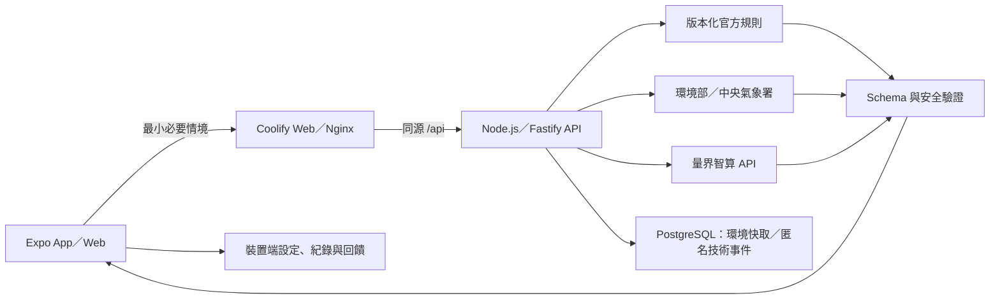

# AirMe 空氣健康小管家

> 競賽版跨平台產品｜決賽：2026-07-26
> 部署目標：自有 VPS 的 Coolify + PostgreSQL + 量界智算

> 競賽合規提醒：官方簡章將「概念驗證（Azure）」列為 25%，且要求雲端資源使用主辦單位指定平台。目前 Coolify／量界方案只能在取得主辦單位書面許可後作為正式概念驗證；否則需保留或恢復指定 Azure 資源路徑。

AirMe 讓使用者用自然語言描述想做的活動，再把 AQI、天氣、最低限度個人敏感條件與官方安全底線，整理成可執行、可解釋且受安全邊界限制的個人行動卡。

## 命名對照

| 用途 | 名稱 |
|---|---|
| GitHub repository／本機根資料夾 | `AirMe` |
| Project slug／Coolify project | `airme` |
| 本機 Docker Compose project | `airme` |
| Coolify services | `airme-web`、`airme-api`、`airme-postgres` |

主要 `docker-compose.yml` 明確設定 `name: airme`；Compose services 使用 `web`、`api`、`postgres` 且不設定 `container_name`。

它不是醫療診斷工具，也不是通用聊天機器人。官方門檻由程式規則控制，AI 不能降低安全底線、發明門檻或判定症狀成因。

## 目前可操作的產品

- 同一套 Expo App 支援 iOS、Android 與 Web。
- 免登入的裝置端個人檔案：以一句自由描述建立受控的敏感條件、粗略地點、通勤與常見活動；原始自我描述不保存。
- 自然語言活動輸入會先整理成活動、時間、地點、強度、時長與當下狀況，缺資料只問一個問題，使用者確認後才產生建議。
- 環境部 AQI 與中央氣象署資料 adapter，保留來源、時間、新鮮度與降級狀態。
- 量界智算 OpenAI 相容 `chat/completions` adapter，以 JSON object 產生固定格式行動卡。
- 程式規則先決定不可突破的風險底線，後端再次驗證模型輸出、資料引用與未經支持的保證，決定性規則會取代衝突建議。
- 限定在空品、活動安全與一般自我保護範圍內追問；醫療、緊急、離題與提示注入有固定處理。
- Air 日誌整合最多 20 筆活動、環境、建議摘要與最多 50 筆活動後回饋（是否進行、不舒服程度、建議是否有幫助、選填註記），只保存在裝置端。
- 路線頁可輸入起點、終點、時間與方式，顯示出發地環境判斷並由使用者主動交接外部地圖；尚未連接即時 route provider，不捏造距離、時間或街道級空品。
- 全面採用淺綠、白色、柔和圓角與留白的亮色介面，AQI 黃／橙／紅只保留為風險語意。
- PostgreSQL 僅保存共享環境快取與不含 payload 的技術事件，不保存個人設定、活動內容、回饋或模型全文。
- 清楚標示的離線示範模式；外部服務不可用時不冒充即時 AI 結果。

完整範圍與驗收標準見 [產品規格](docs/product-spec.md) 與 [驗收清單](docs/acceptance.md)。

## 系統結構

```text
AirMe/
├── app/             # Expo Router：iOS／Android／Web 與 Nginx Docker image
├── backend/            # Node.js + Fastify：資料、規則、AI、安全與 PostgreSQL migration
├── packages/contracts/      # 前後端共用 Zod 資料契約
├── docker-compose.yml       # Coolify Compose：Web、API、PostgreSQL
└── docs/                    # 產品、架構、安全、競賽與部署文件
```

本專案採固定 component roots：Expo 直接位於 `app/`、Fastify 直接位於 `backend/`，共用契約位於 `packages/contracts/`。每個 workspace 的 `package.json` 直接位於 component 根目錄，不增加 project-name、framework-name 或其他分類包層。



後端是唯一可信任邊界。App／Web 不直接持有量界智算、環境部、中央氣象署或 PostgreSQL 的秘密。

## 本機開發

需要 Node.js 22 與 npm。從 repository 根目錄安裝一次依賴：

```bash
npm ci
```

啟動 API fixture 模式（不需要 PostgreSQL 或任何 key）：

```bash
AI_MODE=fixture DATABASE_REQUIRED=false npm run start --workspace airme-api
```

啟動 App／Web：

```bash
npm run start --workspace airme
```

前端預設 API 是 `http://localhost:3000/api`；若 API 使用其他 port，請在 `app/.env` 設定 `EXPO_PUBLIC_API_BASE_URL`。預設 Demo 模式不需要 API key，也不會把 fixture 說成即時資料。

## 品質與評估

```bash
npm test
npm run lint
npm run typecheck
npm run build
npm run evaluate
```

`npm run evaluate` 會執行 30 個正常、敏感、資料品質、醫療、緊急、離題與提示注入案例。

本次架構遷移實際驗證：

- 共用契約、API 與 App 共 170 項自動化測試通過（12 + 106 + 52）。
- 固定安全評估 30/30 通過。
- `npm run lint`、三個 workspace typecheck、production build、Expo Doctor 20/20 與 Compose config 解析通過。
- 本機 AirMe Compose 三服務重建並健康；API 以 `node` 非 root 使用者執行，runtime production dependencies audit 為 0 漏洞，五個 endpoint、緊急 422、malformed JSON 400、migration 與三張預期 table 已實際驗證。
- 尚未對 VPS／Coolify production、真實量界／政府 key 或實體 iOS／Android 執行驗收。

## 環境變數

安全範例位於 [app/.env.example](app/.env.example) 與 [backend/.env.example](backend/.env.example)。

前端只有非秘密設定：

- `EXPO_PUBLIC_API_BASE_URL`
- `EXPO_PUBLIC_API_TIMEOUT_MS`

API 的核心設定：

- `AI_MODE`：`fixture` 或 `live`
- `LIANGJIE_AI_BASE_URL`、`LIANGJIE_AI_MODEL`、`LIANGJIE_AI_API_KEY`
- `MOENV_API_KEY`、`CWA_API_KEY`
- `DATABASE_URL`，或 `DATABASE_HOST`、`DATABASE_PORT`、`DATABASE_NAME`、`DATABASE_USER`、`DATABASE_PASSWORD`
- `DATABASE_REQUIRED`
- `ALLOWED_ORIGINS`、`REQUEST_TIMEOUT_MS`
- `AI_MAX_REQUESTS_PER_MINUTE`、`AI_MAX_CONCURRENCY`
- `CONTEXT_SIGNING_SECRET`、`CONTEXT_TTL_SECONDS`

所有 `EXPO_PUBLIC_*` 都會進入 bundle，不能放 secret。正式值只放 Coolify Environment Variables 或本機忽略的 `.env`。

## API

| Method | Route | 用途 |
|---|---|---|
| `GET` | `/api/health` | 不洩漏設定值的服務／資料庫 readiness |
| `POST` | `/api/environment` | 以 request body 傳送粗略地點，回傳標準化 AQI／天氣與來源狀態 |
| `POST` | `/api/activity-intents` | 不持久化的活動結構化理解與單一澄清問題 |
| `POST` | `/api/recommendations` | 規則約束的結構化行動卡 |
| `POST` | `/api/follow-ups` | 原情境內的限定追問與固定拒答 |

Request／response 型別由 `packages/contracts` 共用；HTTP 錯誤使用穩定代碼，不回傳 stack trace、provider 原始錯誤或秘密。

## Coolify 部署

此 repository 根目錄的 [docker-compose.yml](docker-compose.yml) 定義 `web`、`api`、`postgres` 三個服務。Coolify 將公開網域指向 `web:80`；Nginx 會把同源 `/api/*` 反向代理到 API 容器，因此 Web 不必設定公開 API 網域或 CORS。

部署前只需在 Coolify 填入必要的 PostgreSQL 密碼、context signing secret、量界與政府 API key，然後依 [部署計畫](docs/deployment.md) 完成第一次 migration、health check 與線上驗收。Coolify 是產品部署目標，不等於競賽官方 Azure 概念驗證已合規；這項仍需主辦單位書面確認。沒有 production URL、CI/CD、remote、release 或實際 VPS 部署已被宣稱完成。

本機 Docker fixture 測試使用同一個 Compose 專案的三個服務，不會碰觸其他專案：

```bash
cp .env.local.example .env.local
docker compose --env-file .env.local -f docker-compose.yml -f docker-compose.local.yml up --build -d
```

完成後開啟 `http://localhost:8080`；停止時只停止 AirMe：

```bash
docker compose --env-file .env.local -f docker-compose.yml -f docker-compose.local.yml down
```

## 隱私與安全

- 不蒐集 Email、密碼、姓名、學號、學校、聯絡方式、病歷或長期 GPS 軌跡；可選裝置暱稱只留在本機且不傳後端。
- 新增地點持久化前四捨五入到小數二位（約公里級），API 為舊資料相容最多接受三位，且只接受臺灣服務範圍；後端只接收當次推論必要內容。
- 個人設定、回饋、行動紀錄、路線輸入與完整活動文字不寫入 PostgreSQL。
- PostgreSQL 只保存環境快取與 request ID、路徑、狀態碼、耗時等匿名技術事件。
- 嚴重呼吸困難、昏厥等緊急描述會停止一般建議並提示立即尋求身邊成人與當地緊急協助。

詳見 [安全與隱私](docs/security-and-privacy.md) 與 [AI 安全與評估](docs/ai-safety-and-evaluation.md)。

## 文件索引

- [需求基準](docs/requirements.md)
- [產品規格](docs/product-spec.md)
- [驗收清單](docs/acceptance.md)
- [系統架構](docs/architecture.md)
- [外部整合](docs/integrations.md)
- [資料與儲存](docs/data-and-storage.md)
- [安全與隱私](docs/security-and-privacy.md)
- [部署計畫](docs/deployment.md)
- [競賽展示](docs/competition.md)

## Git 與授權

- 未執行 commit、push、PR、release 或實際部署。
- 這些操作都需要使用者個別明確授權，且執行前必須依 [AGENTS.md](AGENTS.md) 掃描秘密、個資與不應提交文件。
- 原始碼採 MIT License（著作權標示為 `AirMe contributors`）；政府資料、第三方套件、字型與外部素材仍依各自授權與 attribution，不被本 LICENSE 取代。
