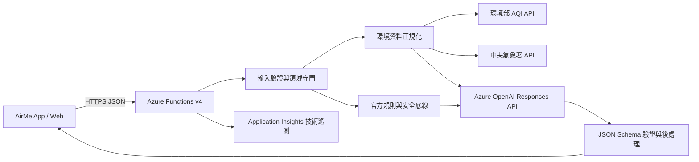

# AirMe 技術與 Azure 架構

## 1. 技術選型結論

採用 React Native + Expo + TypeScript，而非 Flutter。

理由：

- 同一個 Expo Router 專案輸出 iOS、Android 與 Web，符合「單一 AirMe、兩種入口」。
- Web 可以用 responsive layout 或 `.web.tsx` 處理桌面差異，不需建立第二套產品。
- 前端與 Azure Functions 都使用 TypeScript，決賽前只維護一種主要語言與相同資料型別。
- Expo 可快速使用實體手機展示，Web 靜態輸出可部署到 Azure Static Web Apps。

Flutter 仍適合 App-centric 跨平台體驗，但此專案若使用 Flutter，後端仍需另維護 TypeScript／Python，且團隊未提供明顯 Dart 經驗優勢。獨立 React Native App + Next.js Web 雖然自由度高，但會形成三個執行元件，超出決賽時間。

## 2. 元件邊界

### `apps/client`

- 唯一產品前端。
- 管理 UI、裝置端個人設定、活動後回饋與示範 fixture。
- 不持有 secret，不直接呼叫 Azure OpenAI 或政府資料 API。
- 只信任 API 回傳的結構化資料，不渲染未驗證的模型原文。

### `services/api`

- 唯一可信任後端。
- 驗證輸入、取得環境資料、套用官方規則、呼叫 Azure OpenAI、驗證 Structured Outputs。
- 管理 timeout、rate limit、CORS、錯誤映射與安全 log。
- Azure 上使用 Managed Identity／RBAC；外部 API key 放在平台設定或 Key Vault。

### `packages/contracts`

- App 與 API 共用的 Zod runtime schema 與 TypeScript 型別。
- 定義個人設定、粗略地點、環境來源、行動卡、追問、錯誤、回饋與歷史紀錄。
- 由兩個真實執行元件共同使用，避免只共享編譯期型別卻在 runtime 接受無效資料。

## 3. Azure P0 架構



### 必用

| Azure 服務 | P0 責任 | 選擇原因 |
|---|---|---|
| Microsoft Foundry／Azure OpenAI | 情境理解、行動卡與限定追問 | AI 必須是核心；Responses API 支援 Structured Outputs |
| Azure Functions Flex Consumption | 安全後端與外部整合 | Node.js 22、serverless、Managed Identity、App 和 Web 共用 |
| Azure Static Web Apps | 託管 Expo Web 靜態輸出 | `expo export --platform web` 產生靜態檔案 |
| Managed Identity + RBAC | Function 到 Azure OpenAI 的無密碼驗證 | 避免 key 進入程式與前端 |
| Application Insights | request、延遲、錯誤與依賴健康 | 支援現場診斷，但必須關閉敏感 payload 記錄 |

### 有權限且時間足夠再使用

- Key Vault：保存環境部、中央氣象署等無法使用 Entra ID 的 secret。
- Cosmos DB：只有在決賽確定需要匿名服務端回饋時才加入；不建立個人病歷。
- Foundry Evaluation：可用於安全資料集與紅隊測試；沒有權限時用 repository 內固定案例執行同樣測試。

### P0 不使用

Azure Machine Learning、AI Search／RAG、Azure Maps、Document Intelligence、Vision、Speech、Notification Hubs、Power BI、API Management、Data Factory、AKS、VM、班級資料庫。這些服務沒有被最短核心流程需要，加入只會增加權限、成本與失敗面。

## 4. 主辦方 Azure 環境盤點

- 帳戶是主辦方提供的共用 CSP 訂閱。
- 共用資源群組內已有 Foundry、Azure OpenAI 與多種 AI 服務，也混有其他隊伍資源。
- 已看到成功的聊天與 GPT-5 類 deployment，可作為候選模型；實作不得把目前看到的名稱當成永久契約。
- CSP 成本管理畫面無法直接確認本隊個別額度。
- 使用前必須確認允許的 deployment、RBAC、region、rate limit、token 額度與是否能建立新 Function／Static Web App。
- 不讀取、複製或提交 Portal key；不修改或刪除他人資源。

## 5. AI 請求流程

1. 前端建立 `RecommendationRequest`。
2. API 以 Schema 驗證欄位、長度、列舉值與時間。
3. 領域守門器判斷是否為空品、活動與一般自我保護情境。
4. 環境 adapter 取得 AQI／天氣，標記來源、觀測時間與是否過期。
5. 規則引擎根據官方資料產生不可突破的 constraints。
6. Azure OpenAI 接收最小化情境、官方 constraints 與輸出 JSON Schema。
7. 後端驗證 Structured Output、引用事實、內容過濾與禁止語句。
8. 成功回傳行動卡；失敗回傳標準錯誤，不回傳模型原文。

## 6. 已實作 API 契約

### `GET /api/health`

回傳 API 狀態、版本與相依服務摘要。不得回傳 endpoint、deployment、key 或 stack trace。

### `GET /api/environment`

輸入為名稱與最多小數三位的暫時座標；裝置端最多保存一個粗略地點，P0 不保存精確地址或長期軌跡。

回傳：

- location label
- AQI、category、primary pollutant
- weather summary
- observedAt、fetchedAt、stale
- source name、source URL

### `POST /api/recommendations`

簡化輸入範例：

```json
{
  "activityText": "今天下午想跑 1600 公尺",
  "location": { "name": "高雄市", "latitude": 22.627, "longitude": 120.301 },
  "profile": {
    "ageGroup": "teen",
    "sensitiveConditions": ["allergy-sensitive"],
    "commuteMode": "bike"
  },
  "locale": "zh-TW",
  "timeZone": "Asia/Taipei",
  "dataMode": "live"
}
```

行動卡主要欄位：

```json
{
  "actionCard": {
    "riskLevel": "high",
    "headline": "建議降低強度或改到室內",
    "recommendedPlan": {
      "timing": "延後或縮短活動",
      "location": "室內通風空間",
      "intensity": "低強度",
      "equipment": []
    },
    "why": ["AQI 與活動強度觸發較保守底線"],
    "safetyNotes": ["若不舒服請停止活動並告知身邊成人"],
    "environment": {},
    "provenance": {}
  },
  "contextToken": "signed-expiring-context",
  "requestId": "opaque-id"
}
```

完整欄位由 `packages/contracts/src/schemas.ts` 定義；文件範例不可取代程式驗證。

### `POST /api/follow-ups`

輸入短效 `contextToken` 與單一問題；後端使用原已驗證情境，問題離題時回傳拒答狀態，不重新猜測個人或環境資料。

## 7. 錯誤契約

所有 API 錯誤使用 `{ error: { code, message, retryable, requestId } }`：

- `code`：穩定的機器可讀代碼。
- `message`：安全、可顯示的繁體中文訊息。
- `requestId`：除錯關聯值。
- `retryable`：是否建議重試。
重要代碼：`INVALID_REQUEST`、`OUT_OF_SCOPE`、`MEDICAL_BOUNDARY`、`URGENT_SAFETY`、`ENVIRONMENT_UNAVAILABLE`、`AI_UNAVAILABLE`、`CONTEXT_EXPIRED`、`RATE_LIMITED`、`INTERNAL_ERROR`。

## 8. 執行與部署契約

- 本機及 Azure Functions runtime：Node.js 22。
- 依賴：repository 根目錄執行 `npm ci`，使用單一 workspace lockfile。
- Web build：根目錄執行 `npm run build:web --workspace airme`，輸出 `apps/client/dist/`。
- API build：根目錄執行 `npm run build --workspace airme-api`，Functions host 由平台啟動。
- Static Web Apps 與 Functions 可分開部署；手機直接呼叫 Functions HTTPS endpoint。
- 是否將 Functions 連結成 Static Web Apps `/api` backend 需看方案與權限，P0 不依賴 Standard plan 才有的功能。
- 正式 region 應靠近使用者且支援獲准模型；目前尚未核准，不在文件猜值。

## 9. 參考文件

- [Expo 建立專案](https://docs.expo.dev/get-started/create-a-project/)
- [Expo Web 靜態輸出](https://docs.expo.dev/router/web/static-rendering/)
- [Flutter Web FAQ](https://docs.flutter.dev/platform-integration/web/faq)
- [Azure Functions Node.js](https://learn.microsoft.com/en-us/azure/azure-functions/functions-reference-node)
- [Azure Functions Flex Consumption](https://learn.microsoft.com/en-us/azure/azure-functions/flex-consumption-plan)
- [Azure Static Web Apps API 選項](https://learn.microsoft.com/en-us/azure/static-web-apps/apis-overview)
- [Azure 無密碼驗證](https://learn.microsoft.com/en-us/entra/identity/managed-identities-azure-resources/secretless-authentication)
- [Azure OpenAI Responses API](https://learn.microsoft.com/en-us/rest/api/microsoft-foundry/azureopenai/responses)
