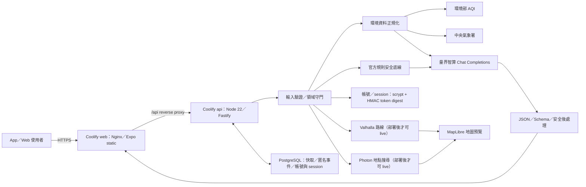

# AirMe 技術與 VPS 架構

## 1. 技術選型

- `app`：React Native + Expo Router + TypeScript，單一專案輸出 iOS、Android 與 Web。
- `backend`：Node.js 22 + Fastify + TypeScript，作為唯一可信任後端。
- `packages/contracts`：Zod runtime schema 與前後端共用型別。
- 部署：自有 VPS 上的 Coolify，使用 repository 根目錄 Compose 建立 Web、API、PostgreSQL。
- AI：量界智算的 OpenAI 相容 Chat Completions API。
- 資料庫：PostgreSQL 保存共享環境快取、匿名技術事件，以及選擇建立帳號者的帳號／session 驗證資料；不保存個人健康內容或同步資料。

Expo 仍適合決賽的單一跨平台產品；Fastify 讓 API 在 VPS 容器中以固定 port 常駐。這不會把 AI 或政府 API key 移進前端。

`app/`、`backend/` 與 `packages/contracts/` 是固定 npm workspace component roots；manifest 直接位於各 component 根目錄。後續不增加 project-name、framework-name 或其他分類包層。

## 2. 元件邊界

### `app`

- 唯一產品前端，負責淺綠白 UI、必要的 Email 帳號入口、登入後輸入式裝置端個人檔案、Air 日誌、MapLibre 路線預覽、回饋與離線 fixture。
- Web image 以 Nginx 提供靜態輸出，並把 `/api/*` 反向代理到 API container。
- 不持有 API key、資料庫帳密或任何伺服器端秘密。
- 裝置暱稱、受控個人設定、回饋與日誌只保留在裝置端，不因登入而同步；個人描述原稿及路線起終點不持久化。session token 只放在 Expo SecureStore。

### `backend`

- 驗證輸入、以不持久化 endpoint 擷取活動意圖、取得環境資料、套用官方規則、呼叫量界智算、驗證模型輸出、簽發短效追問 token，以及處理帳號、地點搜尋與路線請求。
- Fastify 以 `/api` 路由提供 API；不回傳 provider body、stack trace 或秘密。
- migration 由 `npm run db:migrate --workspace airme-api` 執行；容器啟動時會先執行 migration。
- 對 PostgreSQL 的存取限於環境快取、`service_events` 技術事件、帳號／session 驗證資料與 readiness check；路線座標與地點搜尋字串不寫入資料庫或 log。

### `packages/contracts`

- 定義個人設定、粗略地點、活動意圖／澄清、環境來源、行動卡、追問、錯誤、回饋與 Air 日誌摘要的 runtime schema。
- 由 App 與 API 共同使用，避免只共享 TypeScript 型別卻在 runtime 接受無效資料。

## 3. Coolify P0 拓樸

Web 的正式 build 以 `EXPO_PUBLIC_API_BASE_URL=/api` 產生。瀏覽器請求因此使用同源，不須暴露 API container port 或設定 Web 的 CORS。原生 App 不具同源情境，最後打包時必須把 `EXPO_PUBLIC_API_BASE_URL` 設為 HTTPS 公開網域的 `/api`；這個值不是秘密。

## 4. 資料流與安全界線

1. Client 先以 `POST /api/activity-intents` 取得結構化理解；Demo 使用同契約的可重播解析。使用者確認後才建立含 `confirmedIntent` 的 `RecommendationRequest`。
2. API 驗證欄位、長度、列舉、請求 body、臺灣座標範圍與座標精度，進行領域／醫療／緊急守門；意圖請求及推薦請求都不持久化。AI 與環境路由分別受每 process 固定窗口頻率與同時數限制。
3. API 取得 AQI、天氣；Location 契約以受控縣市欄位對應 CWA，避免把校園顯示名稱當成縣市。PostgreSQL 先提供可用快取，外部成功回應才覆寫快取。
4. 程式規則依環境、已確認活動強度與敏感標籤建立不可降低的 risk floor。
5. 量界 adapter 以 `POST /v1/chat/completions`、Bearer key、可設定模型與 JSON object 請求產生草稿。
6. API 以 Zod 驗證草稿，拒絕醫療因果、安全保證、未經支持的歷史／百分比事實與規則衝突；行動強度以決定性規則底線覆寫，理由則後端使用實際請求與環境事實重建。未來活動不把當前 AQI 假當預報。
7. 帳號密碼以 scrypt 雜湊；資料庫只保存 token 的 HMAC digest、到期與撤銷資訊。App 使用 SecureStore 保存原始 session token；登入不會上傳本機 profile、日誌或回饋。
8. 路線／地點搜尋僅在 request 記憶體中轉送給自架 Valhalla／Photon；結果可在 MapLibre 顯示，但不宣稱街道級空品、最低污染或 turn-by-turn 導航。
9. API 不保存一般 request body、個人 profile、活動文字、回饋、路線、context token 或模型完整回應；`service_events` request ID 一律由伺服器產生 UUID，只寫入快取與匿名技術事件。
10. Air 日誌由 client 將確認後的 activity／time／duration／intensity 與環境／建議摘要持久化；明確排除 currentCondition 與自由文字原稿。

## 5. PostgreSQL schema

`backend/database/migrations/001-operational-data.sql` 建立：

| Table | 內容 | 明確不保存 |
|---|---|---|
| `environment_cache` | 受控縣市＋粗略座標 key、固定非個資地點名、標準化 AQI／天氣 JSON、取得時間 | 使用者地點顯示名、使用者 ID、活動、個人條件、精確地址 |
| `service_events` | 隨機 request ID、route、status code、duration、建立時間 | IP、request／response body、prompt、模型輸出、錯誤原文 |

所有 migration 都是版本化 SQL；`schema_migrations` 防止重複執行。決賽正式環境先採單一 API replica，避免多個 container 同時進行第一次 migration；之後再擴容前需加入 migration lock 與連線池容量評估。

`backend/database/migrations/002-accounts.sql` 另建立：

| Table | 內容 | 明確不保存 |
|---|---|---|
| `accounts` | 小寫 Email、顯示名稱、scrypt password hash、隱私同意時間、建立時間 | 個人設定、活動、回饋、健康內容、精確位置 |
| `account_sessions` | 帳號關聯、HMAC token digest、到期與撤銷時間 | 原始 token、IP、裝置指紋、登入 body |

## 6. API 契約

| Method | Route | 說明 |
|---|---|---|
| `GET` | `/api/health` | 不回傳配置的 API／資料庫 readiness |
| `POST` | `/api/environment` | 以 body 傳送粗略地點，回傳 AQI、天氣、來源、時間與降級狀態 |
| `POST` | `/api/activity-intents` | 活動結構化理解、最多一個澄清問題與 AI／fixture provenance |
| `POST` | `/api/recommendations` | 規則底線 + AI／fixture 行動卡 |
| `POST` | `/api/follow-ups` | 原情境內追問；離題、醫療與緊急固定處理 |
| `POST` | `/api/auth/register`、`/api/auth/login` | 建立或驗證產品入口帳號，回傳不透明 session token |
| `GET` | `/api/auth/session` | 驗證目前 session，不回傳 password hash |
| `POST` | `/api/auth/logout` | 撤銷當前 session |
| `DELETE` | `/api/auth/account` | 刪除帳號與所有 server session；不觸及裝置端資料 |
| `POST` | `/api/geocoding/search` | 以自架 Photon 搜尋台灣地點；不持久化查詢 |
| `POST` | `/api/routes` | 以自架 Valhalla 回傳路線選項；不持久化座標 |

公開錯誤固定使用 `{ error: { code, message, retryable, requestId } }`。重要代碼為 `INVALID_REQUEST`、`AUTH_EMAIL_EXISTS`、`AUTH_INVALID_CREDENTIALS`、`AUTH_SESSION_EXPIRED`、`AUTH_UNAVAILABLE`、`ROUTING_UNAVAILABLE`、`GEOCODING_UNAVAILABLE`、`OUT_OF_SCOPE`、`MEDICAL_BOUNDARY`、`URGENT_SAFETY`、`ENVIRONMENT_UNAVAILABLE`、`RATE_LIMITED`、`CONTEXT_EXPIRED` 與 `INTERNAL_ERROR`。Fastify 另將 malformed JSON、32KB 以上 body 與未預期錯誤正規化，不回傳 stack。

## 7. 執行與部署契約

- 本機與 container runtime：Node.js 22。
- API build：`npm run build --workspace airme-api`；啟動：`npm run start --workspace airme-api`。
- migration：`npm run db:migrate --workspace airme-api`。
- Web build：`npm run build:web --workspace airme`，輸出 `app/dist/`。
- Coolify：匯入根目錄 `docker-compose.yml`，公開網域設定到 `web:80`。
- `api` 只以 Compose internal network 暴露 `3000`，避免資料庫與 API port 直接公開。

## 8. 尚未驗證的外部條件

- VPS 的作業系統、Coolify 版本、反向代理、TLS、網域與防火牆。
- 量界智算指定模型對 JSON mode 的實際支援、額度、429 與延遲。
- 真實環境部／中央氣象署欄位、額度與 attribution。
- Valhalla 所需的台灣 OpenStreetMap 圖資、服務資源與 route quality，以及 Photon 索引與服務資源；目前 repository 尚未部署這兩個服務。
- 可用於正式 MapLibre 地圖的自有 style／tile provider、attribution 與用量限制。
- PostgreSQL 容器首次啟動、備份、restore 與磁碟容量。
- iOS／Android 最終安裝形式與原生 App 的 HTTPS API 網域。
