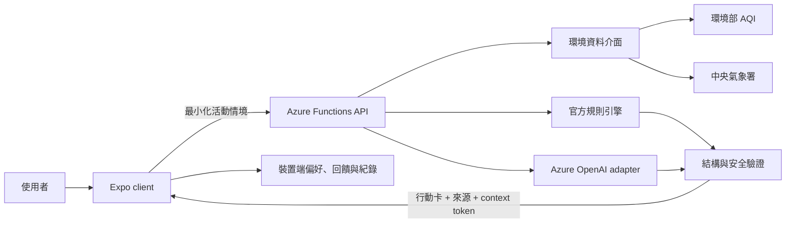

# AirMe 產品系統設計規格

日期：2026-07-13
階段：competition
狀態：已確認實作方向；不代表已部署

## 1. 產品目標

AirMe 是同時支援 iOS、Android 與 Web 的個人空氣健康行動助理。它將環境部空氣品質、中央氣象署天氣、使用者最低限度的個人條件，以及官方活動安全準則整合成容易執行的行動卡。

產品不診斷疾病、不判定症狀成因，也不讓生成式 AI 自行制定 AQI 或活動安全門檻。所有安全門檻由版本化規則引擎決定；Azure OpenAI 只負責理解自然語言情境、組織建議與產生受結構限制的說明。

## 2. 決賽成功標準

一條可重播的主要流程必須能在手機與 Web 完成：

1. 使用者完成最低限度偏好設定。
2. 首頁顯示環境資料來源、更新時間、即時或示範狀態。
3. 使用者以自然語言描述活動、時間、地點、強度與當下狀況。
4. 系統回傳固定格式行動卡，包含風險等級、建議調整、理由、官方資料與安全提醒。
5. 使用者可針對同一情境追問；離題、醫療診斷與緊急情境會被安全處理。
6. 活動後可在五秒內完成回饋，並在裝置端查看近期紀錄。
7. 外部環境資料或 AI 無法使用時，介面清楚標示降級狀態並切換到可重播的決賽示範。

## 3. 系統範圍

### 3.1 `apps/client`

- Expo Router + TypeScript 的單一跨平台 client。
- 提供初次設定、今日環境、活動輸入、行動卡、追問、回饋、紀錄、設定與示範模式。
- 個人偏好與回饋預設只存在裝置端。
- 前端只知道 API base URL，不保存或呼叫 Azure OpenAI、環境部、中央氣象署的秘密。

### 3.2 `services/api`

- Azure Functions v4 + Node.js 22 + TypeScript。
- 集中處理政府開放資料、官方規則、Azure OpenAI、輸入與輸出驗證、CORS、逾時與錯誤降級。
- 不建立雲端個人資料庫，也不保存長期個人健康紀錄。
- 每次請求只接收產生當次行動卡必要的最少情境。

### 3.3 共用合約

建立 `packages/contracts`，由 Zod schema 同時產生 runtime 驗證與 TypeScript 型別。client 與 API 以同一合約交換資料，避免展示前才發現欄位不一致。

## 4. 核心資料流程

### 4.1 建議請求

client 傳送：

- 自然語言活動描述。
- 必要的年齡層、敏感條件旗標、通勤方式與活動偏好。
- 選定地點或座標的有限精度表示。
- client 顯示語言、時區與示範模式。

API 執行：

1. 驗證長度、列舉值、座標範圍與資料最小化限制。
2. 解析活動意圖；無法使用 AI 時以本機規則與明確預設值降級。
3. 取得環境資料，保留來源、觀測／發布時間與新鮮度。
4. 由規則引擎計算不可被模型覆蓋的安全底線。
5. 將必要情境、環境摘要與安全底線交給模型，以 JSON Schema 限制輸出。
6. 對模型結果再次驗證，移除診斷、因果宣稱與超出領域的內容。
7. 回傳行動卡、追蹤 ID、降級狀態與短期簽章 context token。

### 4.2 追問

系統不建立 server-side 對話資料庫。首次建議會附上一個短期、具簽章且可過期的 context token，內容只保留追問所需的最小化環境摘要、規則結果與行動情境。追問 API 驗證 token 後，僅回答同一活動的空品、活動安全與一般自我保護問題。

以下內容必須拒答或導向安全協助：

- 病名、診斷、用藥、治療或症狀成因判斷。
- 與目前空品／活動安全無關的一般聊天。
- 要求忽略官方安全門檻或鼓勵危險活動。
- 明顯急性危險訊號；此時顯示立即停止活動、尋求身邊成人與當地緊急協助的固定訊息。

## 5. 行動卡合約

行動卡至少包含：

- `riskLevel`：`low | moderate | high | very-high`。
- `headline`：一句可掃讀結論。
- `recommendedPlan`：時間、地點、強度或裝備的具體調整。
- `why`：最多三項有資料或規則依據的理由。
- `safetyNotes`：固定安全提醒與適用限制。
- `environment`：AQI、主要污染物、天氣摘要、來源、更新時間與新鮮度。
- `provenance`：`live | partial | fixture`，以及實際使用的 AI／環境模式。
- `contextToken`：供同一情境短期追問使用。
- `requestId`：除錯與展示追蹤用途，不含個資。

任何不符合 schema、違反規則底線、缺少來源或出現醫療宣稱的模型輸出都不直接顯示。

## 6. 環境資料與降級設計

環境資料介面提供三種可觀察模式：

- `live`：環境部與中央氣象署均成功取得有效資料。
- `partial`：其中一項失敗，使用仍有效的來源搭配保守規則。
- `fixture`：明確選擇決賽示範，或 live 資料完全不可用時採用內建固定情境。

示範資料必須在 UI 顯示「決賽示範資料」，不能偽裝成即時資料。快取資料若超過允許的新鮮度，也必須顯示更新時間與過期狀態。

## 7. Azure OpenAI 設計

- 後端透過 adapter 呼叫 Azure OpenAI Responses API。
- 正式環境優先以 Managed Identity／Microsoft Entra ID 取得權限。
- 本機可使用 `DefaultAzureCredential`；只有主辦方安全提供已輪替金鑰時，才允許後端環境變數作為備援。
- deployment、endpoint、timeout 與 model mode 全部由後端環境變數設定。
- 測試與決賽離線重播使用 deterministic fake adapter，不需要秘密。
- prompt 只提供當次必要情境；不傳送姓名、學號、聯絡方式或完整長期紀錄。

目前 Azure 訂閱為共用環境，本規格只準備可部署程式與設定介面，不建立、修改、刪除或部署任何 Azure 資源。

## 8. 本機資料與隱私

client 使用 AsyncStorage 保存：

- 最低限度個人偏好。
- 最近產生的去識別化行動卡摘要。
- 五秒回饋：是否完成、感受與簡短選填備註。
- demo mode 與介面偏好。

不保存完整模型 prompt、API token、精確長期定位軌跡、姓名、學號、聯絡方式或醫療診斷。使用者可在設定中清除全部裝置端資料。

## 9. UI 與互動原則

- 繁體中文為主要語言，語氣具體、平靜、可行動。
- 手機優先；Web 在較寬畫面採雙欄資訊階層，但不建立另一套產品。
- 首頁先回答「現在適不適合做這件事」；來源與技術資訊位於次要層級。
- 以一致色彩、文字與圖示共同表達風險，不只依賴顏色。
- 可點區至少 44×44 pt，文字支援動態字級，表單有 label、錯誤與鍵盤操作。
- 尊重 reduced motion；動畫只用於狀態轉換與回饋，不影響理解。
- 所有 fixture、partial、stale 與 error 狀態都提供清楚文字，不用模糊的「發生錯誤」。

## 10. 錯誤模型

API 使用穩定錯誤碼與安全訊息：

- `INVALID_REQUEST`
- `OUT_OF_SCOPE`
- `MEDICAL_BOUNDARY`
- `URGENT_SAFETY`
- `ENVIRONMENT_UNAVAILABLE`
- `AI_UNAVAILABLE`
- `CONTEXT_EXPIRED`
- `RATE_LIMITED`
- `INTERNAL_ERROR`

回應包含 `requestId` 與可否重試，但不回傳 stack、prompt、秘密、原始供應商錯誤或敏感輸入。

## 11. 測試與驗收

### 11.1 合約與單元測試

- schema 接受正確資料並拒絕越界／過長／未知欄位。
- 規則引擎以官方門檻 fixture 驗證不同 AQI 與活動強度。
- safety guard 覆蓋醫療、離題、危險提示與 prompt injection。
- context token 覆蓋有效、過期、竄改與錯誤簽章。
- environment 與 AI adapter 覆蓋成功、逾時、錯誤格式與降級。

### 11.2 API 整合測試

- health、environment、recommendations、follow-ups 端點。
- CORS、request ID、錯誤碼與 provenance。
- 以 fake adapter 完成無秘密的 deterministic 主流程。

### 11.3 client 測試

- 初次設定資料最小化與必填驗證。
- 首頁三種環境狀態。
- 活動輸入、行動卡、追問邊界、回饋與清除資料。
- 手機與 Web 的主要斷點、鍵盤與可及性名稱。

### 11.4 AI 評估

至少 30 個固定案例，包含正常活動、敏感族群、資料過期、離題、診斷、緊急情境、注入攻擊、模型格式錯誤與供應商失敗。評估以規則符合率、schema 通過率、拒答正確率、來源完整率與降級可用性為核心，不宣稱醫療效果。

## 12. 建置順序

1. 共用合約、測試基礎與根目錄品質指令。
2. 官方規則、安全 guard、環境 adapter 與 fixtures。
3. Azure OpenAI adapter、簽章 context 與 recommendation orchestration。
4. Azure Functions 端點與無秘密整合測試。
5. client design system、本機儲存、導覽與各 P0 畫面。
6. 端到端示範流程、30 案例評估、文件同步與建置驗證。

## 13. 明確不做

- 教師端、班級端、管理後台或多人角色系統。
- 雲端個人資料庫、登入系統、長期定位追蹤或成熟預測模型。
- 醫療診斷、治療、症狀成因判斷或取代專業協助。
- 未授權的 Azure 資源建立、RBAC 變更、部署、release、remote、commit 或 push。
